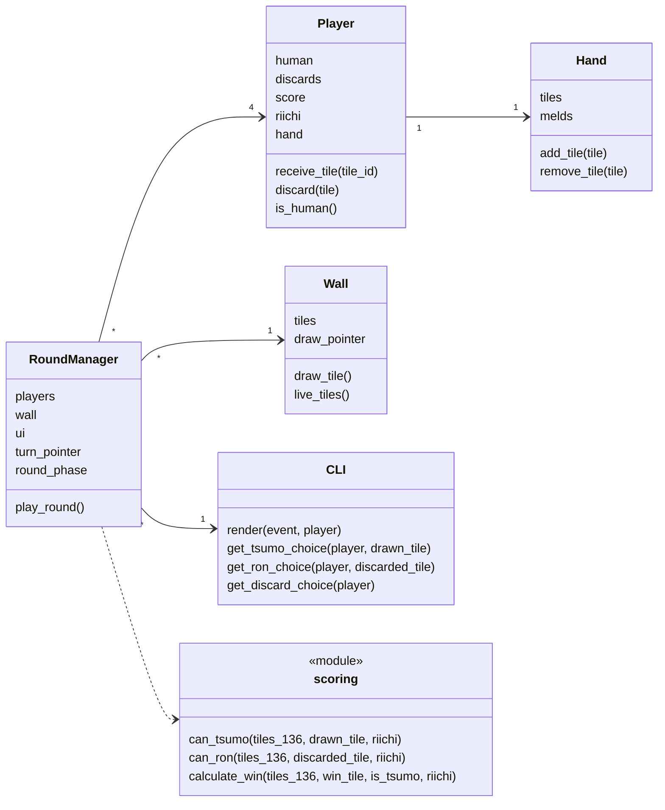
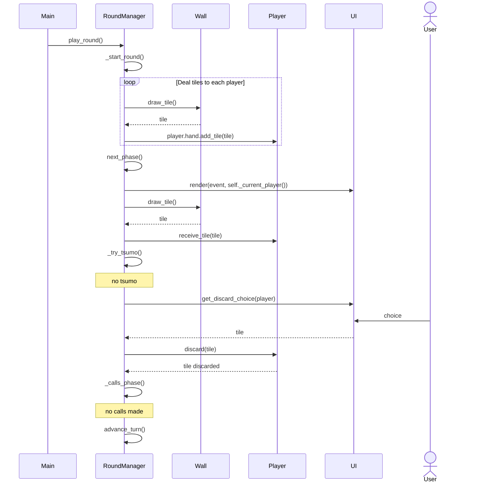

# Arkkitehtuuri

## Luokkakaavio

```mermaid
classDiagram
    direction LR

	class Hand {
		tiles
        melds
    add_tile(tile)
    remove_tile(tile)
	}

    Player "1" --> "1" Hand
	class Player {
		human
        discards
        score
        riichi
        hand
        receive_tile(tile_id)
        discard(tile)
        is_human()
	}

	class Wall {
		tiles
        draw_pointer
        draw_tile()
        live_tiles()
	}

    RoundManager "*" --> "1" Wall
    RoundManager "*" --> "4" Player
    RoundManager "*" --> "1" CLI
    RoundManager ..> scoring
	class RoundManager {
		players
        wall
        ui
        turn_pointer
        round_phase
        play_round()
	}

	class CLI {
		render(event, player)
        get_tsumo_choice(player, drawn_tile)
        get_ron_choice(player, discarded_tile)
        get_discard_choice(player)
	}

    class scoring {
        <<module>>
        can_tsumo(tiles_136, drawn_tile, riichi)
        can_ron(tiles_136, discarded_tile, riichi)
        calculate_win(tiles_136, win_tile, is_tsumo, riichi)
    }

```

## Pelilogiikka

### Pelin aloitus ja ensimmäisen pelaajan vuoro

```mermaid
sequenceDiagram
    participant Main
    participant RoundManager
    participant Wall
    participant Player
    participant UI
    actor User

    Main->>RoundManager: play_round()
    RoundManager->>RoundManager: _start_round()

    loop Deal tiles to each player
        RoundManager->>Wall: draw_tile()
        Wall-->>RoundManager: tile
        RoundManager->>Player: player.hand.add_tile(tile)
    end


    RoundManager->>RoundManager: next_phase()
    RoundManager->>UI: render(event, self._current_player())

    RoundManager->>Wall: draw_tile()
    Wall-->>RoundManager: tile
    RoundManager->>Player: receive_tile(tile)
    RoundManager->>RoundManager: _try_tsumo()
    Note over RoundManager: no tsumo


    RoundManager->>UI: get_discard_choice(player)
    User->>UI: choice
    UI-->>RoundManager: tile
    RoundManager->>Player: discard(tile)
    Player-->>RoundManager: tile discarded

    RoundManager->>RoundManager: _calls_phase()
    Note over RoundManager: no calls made
    RoundManager->>RoundManager: advance_turn()

```