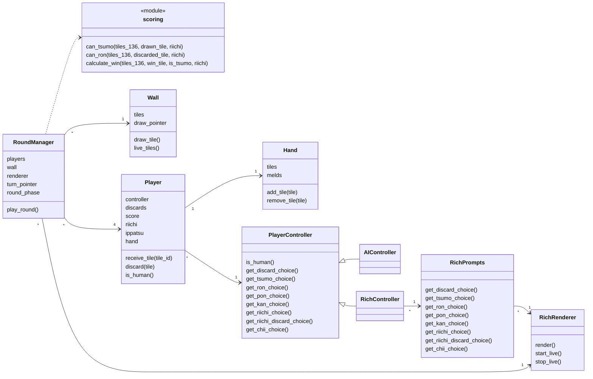
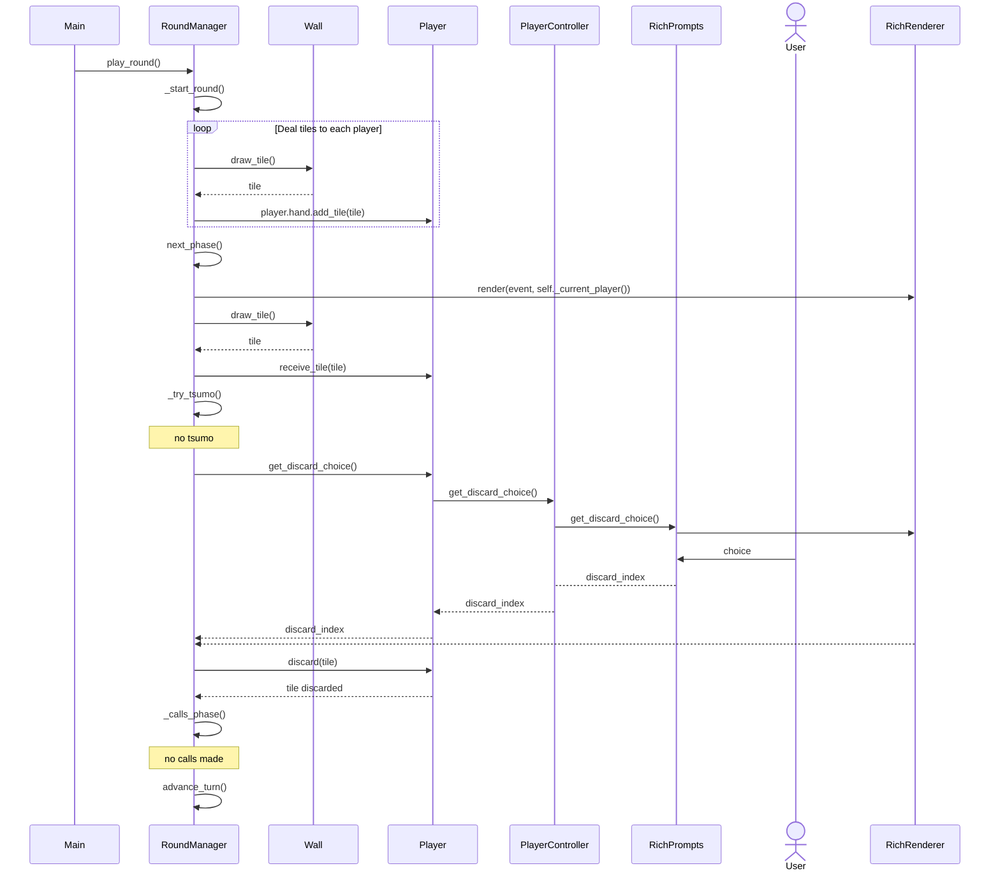

# Arkkitehtuurikuvaus

- Pelin ymmärtämistä ja termejä suomeksi voi avata tällä sivulla, jos mahjong ei ole ennestään tuttu: https://www.mahjongopas.info/saannot/japanilainen-riichi/saannot/

## Rakenne

Sovellus on jaettu kolmeen osaan:

- `src/core`: Pelille tarpeelliset oliot ja funktiot (hand/kädet, pelaajat, wall/muurirakenne, melds/setit, pisteytys)
- `src/game`: Pelin kulun toteuttava luokka RoundManager. RoundManager luo tapahtumia, jotka se antaa rendereröinti luokalle. Renderöivä luokka on erotettu täysin pelilogiikasta, joten UI:n muutokset eivät vaikuta peliin.
- `src/ui`: UI hakemisto sisältää RichRenderer luokan, RichPrompts luoka sekä controller luokat. Controller luokkien kautta saadaan pelaajien tekemät päätökset. Ihmispelaajalta halutut päätökset delegoidaan RichPrompts luokalle, joka käyttää RichRenderer luokkaa informaation näyttämiseen pelaajalle.
- `src/main.py` alustaa pelin (pelaajat + UI + muuri) ja käynnistää kierroksen

### Luokkakaavio

## Käyttöliittymä

Sovelluksella on Rich pohjainen komentorivikäyttöliittymä. Peli päivittää pelinäkymää RoundManagerilta saatujen eventtien ja pelitilan mukaan ja kysyy pelaajalta tarvittavat päätökset. Viskattava tiili valitaan kädestä numeroilla 1-13, tai juuri nostettu tiili numerolla 0. Jos pelaaja on vaatinut settejä, on pelattavia tiiliä vähemmän, kuten tässä kuvassa.

## Sovelluslogiikka

Pelin päävastuu on `RoundManager`-luokalla, joka on toteutettu tilakoneena:

1. **Alustus/jako**: muuri (`Wall`) luodaan ja pelaajille jaetaan aloituskädet.
2. **Vuoro**: aktiivinen pelaaja nostaa tiilen, tarkistetaan mahdollinen tsumo (voittava käsi), sitten pelaaja valitsee minkä tiilen viskaa kädestä.
3. **Calls/vaatiminen**: muut pelaajat voivat vaatia viskauksen ja ottaa viskatun tiilen itselleen (ron, pon/kan, chii).
4. **Vuoron vaihtuminen**: jos vaadintaa ei tehdä, vuoro siirtyy seuraavalle pelaajalle. Vaadinta myös vaihtaa aktiivisen pelaajan.
5. **Kierroksen loppu**: kierros päättyy voittoon (tsumo/ron) tai tiilien loppumiseen muurista.

`ui` renderöi eventit ja kysyy pelaajien valinnat, kun taas `core` toteuttaa sääntöihin liittyvät operaatiot (esim. käden muokkaus, vaadintojen tarkistus, voittokäden validointi, pisteytyksen laskenta).

### Pelilogiikan sekvenssikaaviot

#### Pelin aloitus ja ensimmäisen pelaajan vuoro

Kaavio kuvaa pelin alkua. Aluksi pelaajille jaetaan tiilet, jonka jälkeen peli kutsuu next_phase() metodia joka aloittaa varsinaisen pelin. RoundManager ottaa muurista tiilen ja laittaa sen vuorossa olevan pelaajan käteen. Jos (kun) pelaaja ei voita, RoundManager kutsuu Player luokalta päätöstä get_discard_choice() metodilla.

Player luokalla on riippuvuus PlayerControlleriin, jolta saadaan varsinaiset päätökset. Koska kyseessä on ihmispelaaja ja RichController eikä AIController, RichController kysyy päätöstä RichPrompts luokan kautta. Pelaajan tekemä päätös palautuu RoundManagerille, joka poistaa oikean tiilen pelaajalta.

Seuraavaksi RoundManager tarkistaa haluaako muut pelaajat vaatia viskauttua tiiltä, jonka jälkeen siirrytään seuraavan pelaajan vuoroon, joka etenee samaan tapaan.

## Rakenteelliset ongelmat

RoundManagerin tuottamat eventit eivät sisällä koko pelin tilaa, joka oli ehkä hieman huono rakenteellinen lopputulos. Tämä tuli korjattua myöhemmin metodilla joka palauttaa pelitilan erillisenä. En osannut odottaa, että RoundManagerista tulisi niin monimutkainen, ja tällaiset pienet projektin alussa tehdyt päätökset aiheuttivat vaivaa myöhemmin.

Toinen todella huono kehitystä hidastava rakenteellinen päätös oli tiilien käsitteleminen pelkkinä tile_id lukuina. Ajattelin että tämä olisi kätevää, koska Mahjong kirjasto käsittelee ne samassa formaatissa, mutta tiilelle olisi kuitenkin parempi olla oma luokkansa. Syy tähän on läpinäkyvyys ja testattavuus. Nyt on hyvin vaikeaa nähdä mitkä tiilet on mitäkin pelkistä numeroista, ja testien tekemisestä tuli todella vaikeaa.
