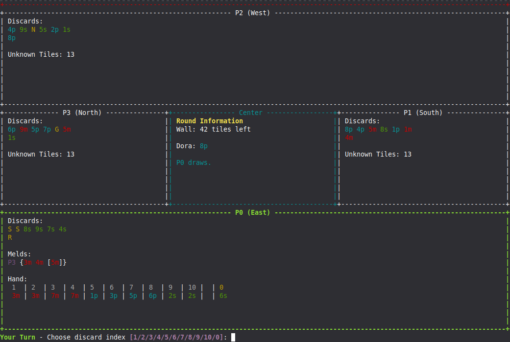
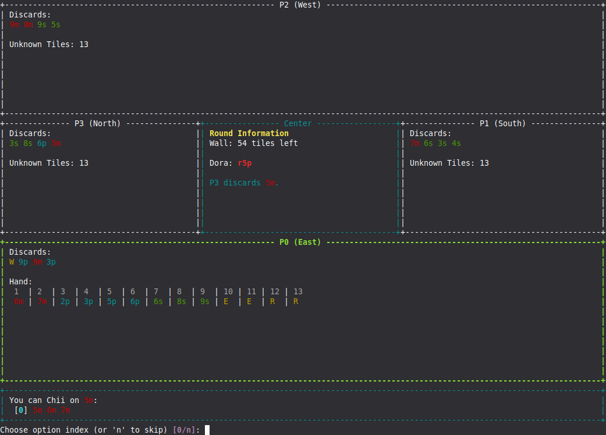
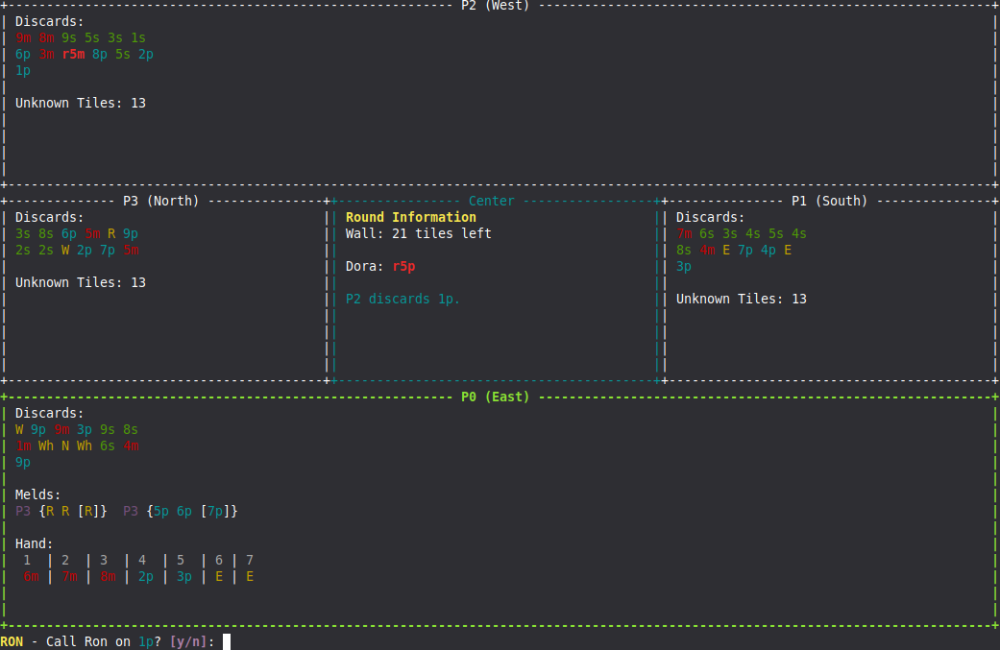

### Pelin asentaminen

Riippuvuuksien asennus:
```
poetry install
```
Pelin käynnistäminen:
```
poetry run invoke start
```
Huomio! Jotta pelin näkymä toimii oikein, on ikkunan oltava tarpeaksi suuri. Liian pienellä ikkunalla pelin renderöinti ei toimi. 


### Pelin tavoite

Riichi Mahjongissa on tavoitteena rakentaa voittavia käsiä. Voittava käsi muodostuu neljästä setistä ja yhdestä parista. Setit voivat olla muotoa pon (3m3m3m) tai chii (1m2m3m). Kädessä tulee myös olla [yaku](https://riichi.wiki/List_of_yaku) jotta sillä voi voittaa. Helpoin yaku on tanyao, jolloin kädessä ei saa olla muita tiiliä kuin 2m-8m, 2p-8p ja 2s-8s.

#### Viskauksen valinta



Viskaus valitaan antamalla numero. Numerolla 0 voidaan viskata juuri nostettu tiili.

#### Setit



Pelaaja voi joskus vaatia toisen pelaajan viskaaman tiilen. Jos tiili sopii useampaan chii settiin, saa pelaaja valita minkä niistä haluaa. Pon vaadinta on pelkkä y/n prompti.

#### Voitto



Tässä pelaajalla on voittava käsi. Voittoehdon täyttää vaadittu Chun(R) setti. Viimeinen täytettävä setti on 2p3p, eli voittavat tiilet ovat 1p ja 4p. Parina on Itätuuli(E).
