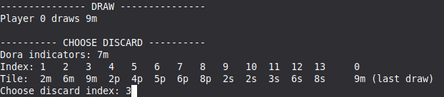

### Pelin asentaminen

Riippuvuuksien asennus:
```
poetry install
```
Pelin käynnistäminen:
```
poetry run invoke start
```

### Pelin tavoite

Riichi Mahjongissa on tavoitteena rakentaa voittavia käsiä. Voittava käsi muodostuu neljästä setistä ja yhdestä parista. Setit voivat olla muotoa pon (3m3m3m) tai chii (1m2m3m). Kädessä tulee myös olla [yaku](https://riichi.wiki/List_of_yaku) jotta sillä voi voittaa. Helpoin yaku on tanyao, jolloin kädessä ei saa olla muita tiiliä kuin 2m-8m, 2p-8p ja 2s-8s.

#### Viskauksen valinta



Viskaus valitaan antamalla numero. Tässä ollaan viskaamassa tiili 9m.

#### Setit


Pelaaja voi joskus vaatia toisen pelaajan viskaaman tiilen. Jos tiili sopii useampaan chii settiin, saa pelaaja valita. Pon vaadinta on pelkkä y/n prompti.

#### Voitto


Tässä pelaajalla on tanyao käsi. Kädessä on setit: r5m5m5m, 7p7p7p, 6p6p6p; pari :8p8p. Käsi odottaa viimeistä tiiltä settiin 6s7s, joten pelaaja voi vaatia Ronin tiilellä 5s. Voiton jälkeen peli loppuu.