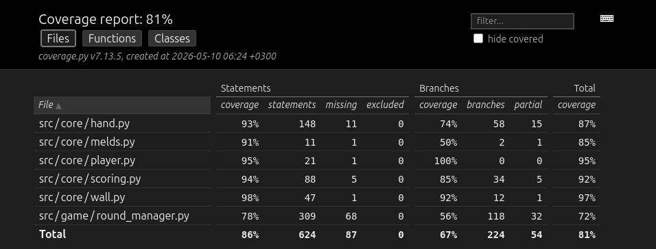

# Testausdokumentti

Peliä on testattu automaattisilla yksikkötesteillä ja integraatiotesteillä. Peliä on myös testattu manuaalisesti pelaamalla sekä asettamalla muuri etukäteen haluttuun tilaan.

## Yksikkö- ja integraatiotestit

Core osion Hand luokkaa ja Wall luokkien metodeja testataan niiden omilla testiluokillaan. Nämä testit ovat yksikkötestejä. Player ja Meld luokilla ei ole yksikkötestejä, sillä ne ovat mielestäni hyvin yksinkertaisia ja toimivat integraatiotestauksessa. Scoring moduulia testataan yksikkötesteillä.

RoundManager on integraatiotestauksen pääkohde, jonka testaamisesta vastaa TestRoundManager luokka. RoundManagerin testauksessa pelaajaolioiden päätöksenteon apuna käytetään joissain testeissä StubController luokkaa, jolle voidaan kertoa mitä pelaajan tulisi valita missäkin tilanteessa.

### Testikattavuus

Pelin haaraumakattavuus on 67%. Kattavuusraportista on jätetty pois main.py ja käyttöliittymään liittyvät osiot.

Haaraumakattavuus jäi RoundManagerilla vähän turhan alhaiseksi. Peli logiikka on paljon monimutkaisempi toteutettava kuin osasin oikeastaan odottaa, ja luokasta tuli aivan liian massiivinen ja testattavaa riittäisi. Testeillä testataan "hyvät" tapaukset kohtuullisen hyvin. Väärien arvojen testejä on vähemmän, jonka takia monet haarat joihin ei pitäisi päätyä jäävät testaamatta.

## Järjestelmätestaus

Pelin asennus ohjeiden mukaan on testattu Linux ympäristössä. 

### Manuaalinen testaus

Pelin sääntöjen mukaisia tapahtumia on testattu halutunlaisilla muureilla ja käsillä manuaalisesti. Peli ei kaadu virheellisillä syötteillä ja antaa niistä hyvät palautteet käyttäjälle, eikä pelissä ole ilmaantunut odottamattomia virheitä.
