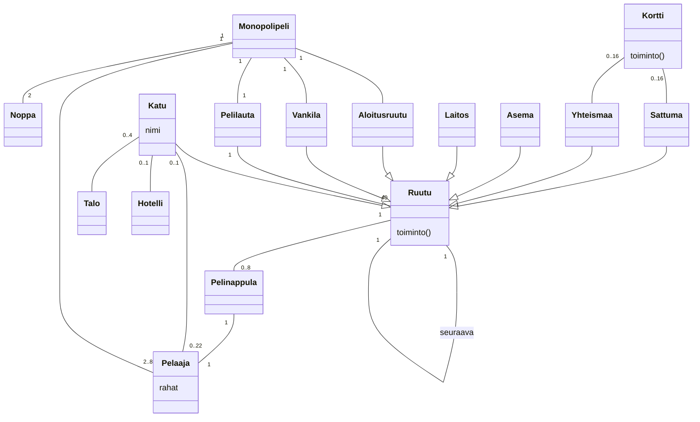

```mermaid
 classDiagram
    Monopolipeli "1" -- "2" Noppa
    Monopolipeli "1" -- "1" Pelilauta
    Ruutu "1" -- "0..8" Pelinappula
    Pelinappula "1" -- "1" Pelaaja
    Pelaaja "2..8" -- "1" Monopolipeli
    Ruutu "1" -- "1" Ruutu : seuraava

    Katu "0..1" -- "0..22" Pelaaja
    Sattuma --|> Ruutu
    Yhteismaa --|> Ruutu
    Asema --|> Ruutu
    Laitos --|> Ruutu
    Aloitusruutu --|> Ruutu
    Vankila --|> Ruutu
    Pelilauta "1" -- "40" Ruutu
    Katu --|> Ruutu

    Monopolipeli "1" -- Aloitusruutu
    Monopolipeli "1" -- Vankila

    Ruutu : toiminto()
    Katu : nimi

    Katu "0..4" -- Talo
    Katu "0..1" -- Hotelli

    Kortti "0..16" -- "" Sattuma
    Kortti "0..16" -- "" Yhteismaa

    Kortti : toiminto()

    Pelaaja : rahat
```