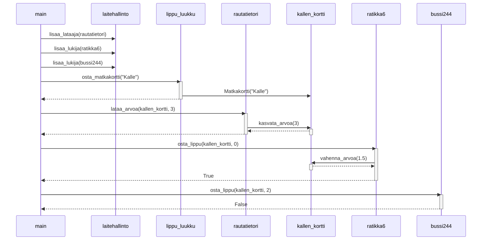

```mermaid
sequenceDiagram
    participant main
    participant laitehallinto
    participant lippu_luukku
    participant rautatietori
    participant kallen_kortti

    main ->> laitehallinto : lisaa_lataaja(rautatietori)
    main ->> laitehallinto : lisaa_lukija(ratikka6)
    main ->> laitehallinto : lisaa_lukija(bussi244)
    main ->> lippu_luukku : osta_matkakortti("Kalle")
    
    activate lippu_luukku
    lippu_luukku ->> kallen_kortti : Matkakortti("Kalle")
    lippu_luukku -->> main :
    deactivate lippu_luukku

    main ->> rautatietori : lataa_arvoa(kallen_kortti, 3)
    activate rautatietori
    rautatietori ->> kallen_kortti : kasvata_arvoa(3)
    activate kallen_kortti
    kallen_kortti -->> rautatietori :
    deactivate kallen_kortti
    rautatietori -->> main :
    deactivate rautatietori

    main ->> ratikka6 : osta_lippu(kallen_kortti, 0)
    activate ratikka6
    ratikka6 ->> kallen_kortti: vahenna_arvoa(1.5)
    activate kallen_kortti
    kallen_kortti -->> ratikka6 :
    deactivate kallen_kortti
    ratikka6 -->> main : True
    deactivate ratikka6

    main ->> bussi244 : osta_lippu(kallen_kortti, 2)
    activate bussi244
    bussi244 -->> main : False
    deactivate bussi244
```